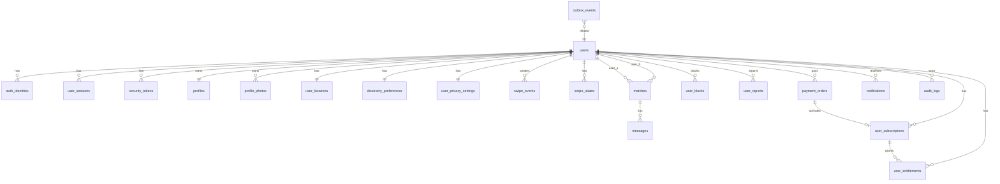

# Database Source of Truth v1
# CHANGELOG & REVISION HISTORY
| Date | Change Summary | Sections Changed |
|---|---|---|
| 2026-06-11 | Initial approved compact database foundation for dating/social matchmaking platform | Entire file |

> This file is the database source of truth for AI agents and developers. Do not modify database schema, migrations, or Prisma models until this document is reviewed and approved.

## 1. Goal

Design a compact but production-capable PostgreSQL database for a Dating / Social Matchmaking Platform. The schema must support auth, onboarding, discovery, swipe, match, chat, safety, VNPAY prepaid premium, in-app notification, audit logging, and outbox-based async processing.

## 2. Final Table List

1. `users` - Tài khoản gốc của người dùng. Bảng này quản lý email, trạng thái tài khoản, trạng thái onboarding và vai trò đơn giản user/moderator/admin.
2. `auth_identities` - Lưu phương thức đăng nhập. Tách khỏi users để hỗ trợ email/password và Google OAuth sau này.
3. `user_sessions` - Quản lý refresh-token session cho cookie-based auth, logout current device, logout all devices và refresh token rotation.
4. `security_tokens` - Token ngắn hạn cho email verification, password reset và account restore.
5. `profiles` - Dating profile chính. Không chứa auth/session. Các field lifestyle/interests dùng JSON để giảm số bảng trong phase đầu.
6. `profile_photos` - Ảnh profile và trạng thái upload/moderation. Gộp media metadata để không cần media_files/photo_upload_intents trong phase đầu.
7. `user_locations` - Lưu vị trí thật và passport location. Dùng PostGIS/geography point trên PostgreSQL/RDS.
8. `discovery_preferences` - Điều kiện tìm kiếm của user trong discovery feed.
9. `user_privacy_settings` - Cài đặt privacy/discovery visibility.
10. `swipe_events` - Lịch sử immutable của like/pass/super_like/rewind. Dùng cho audit, quota rolling 24h, rewind và who-liked-me.
11. `swipe_states` - Trạng thái swipe hiện tại theo một chiều giữa hai user, để discovery loại/filter nhanh.
12. `matches` - Một record lifetime cho một cặp user. Chứa trạng thái match, read state và unread counts cho chat 1-1.
13. `messages` - Tin nhắn trong match. Phase này chỉ text và image, không GIF/voice.
14. `user_blocks` - Quan hệ block. Block tạo mutual invisibility và khóa chat/notification giữa hai user.
15. `user_reports` - Report user/profile/photo/message/match để moderation xử lý.
16. `payment_orders` - Giao dịch thanh toán VNPAY. Đây là source of truth cho trạng thái thanh toán.
17. `user_subscriptions` - Gói premium đang/cựu active của user. Plan config nằm trong app/spec, chưa có subscription_plans table.
18. `user_entitlements` - Quyền premium cụ thể được mở khóa từ subscription hoặc manual grant.
19. `notifications` - In-app notification inbox. Không dùng push/device token trong phase này.
20. `audit_logs` - Nhật ký hành động quan trọng phục vụ debug, support, moderation và security.
21. `outbox_events` - Event nội bộ được lưu trong DB để xử lý async ổn định: match, payment, notification, realtime.

## 3. Core Business Decisions

- Username is not supported in phase 1; use display_name only.
- Changing email is out of scope for phase 1.
- Soft delete account, then anonymize after 30 days.
- Max profile photos is config-driven, default 6.
- Chat supports text and image only; no GIF, no voice in phase 1.
- Notification is in-app only; no push/device token table in phase 1.
- Report target types: user, profile, photo, message, match.
- Premium plans are PLUS_MONTHLY and GOLD_MONTHLY in app config; no subscription_plans table.
- VNPAY is prepaid subscription, not recurring billing.
- PostgreSQL + PostGIS direction for location.

## 4. Discoverable User Rule

A user is discoverable only if all conditions are true:

- `users.account_status = active`
- `users.email_verified_at IS NOT NULL`
- `users.onboarding_status = completed`
- has at least one approved, confirmed, non-deleted profile photo
- has active location
- `user_privacy_settings.is_hidden = false`
- not suspended, banned, deleted
- no active block relationship with requester

## 5. ERD

## 6. Table Specifications

### 1. `users`

**Group:** Identity & Auth

**Purpose:** Tài khoản gốc của người dùng. Bảng này quản lý email, trạng thái tài khoản, trạng thái onboarding và vai trò đơn giản user/moderator/admin.

**Columns:**

| Column | Type | Requirement | Notes |
|---|---|---|---|
| `id` | `uuid` | PK | Định danh user. |
| `email` | `varchar(320)` | required | Email hiển thị/nhận thông báo. |
| `email_normalized` | `varchar(320)` | unique, required | Email lowercase/trim dùng để unique lookup. |
| `email_verified_at` | `timestamptz` | nullable | Có giá trị khi user đã verify email. |
| `account_status` | `enum` | required | pending_email_verification, active, suspended, banned, deleted. |
| `onboarding_status` | `enum` | required | not_started, in_progress, completed. |
| `user_role` | `enum` | required | user, moderator, admin. Không dùng RBAC tables trong phase này. |
| `last_login_at` | `timestamptz` | nullable | Lần login gần nhất. |
| `onboarding_completed_at` | `timestamptz` | nullable | Thời điểm hoàn tất onboarding. |
| `deleted_at` | `timestamptz` | nullable | Soft delete. |
| `deletion_scheduled_at` | `timestamptz` | nullable | Sau 30 ngày sẽ anonymize. |
| `created_at` | `timestamptz` | required | Tạo bản ghi. |
| `updated_at` | `timestamptz` | required | Cập nhật bản ghi. |

**Business Rules:**
- User chưa verify email vẫn được onboarding nhưng không discoverable.
- Verify email xong chuyển account_status từ pending_email_verification sang active.
- Deleted account không login/swipe/chat/discovery.
- Admin/moderator phase này dùng user_role, chưa dùng RBAC.

**Indexes / Constraints:**
- `unique(email_normalized)`
- `index(account_status)`
- `index(onboarding_status)`
- `index(user_role)`

### 2. `auth_identities`

**Group:** Identity & Auth

**Purpose:** Lưu phương thức đăng nhập. Tách khỏi users để hỗ trợ email/password và Google OAuth sau này.

**Columns:**

| Column | Type | Requirement | Notes |
|---|---|---|---|
| `id` | `uuid` | PK | Định danh identity. |
| `user_id` | `uuid` | FK users.id | Chủ sở hữu. |
| `provider` | `enum` | required | email, google. |
| `provider_user_id` | `varchar` | required | email_normalized hoặc google_sub. |
| `password_hash` | `text` | nullable | Chỉ có với provider=email. |
| `created_at` | `timestamptz` | required |  |
| `updated_at` | `timestamptz` | required |  |

**Business Rules:**
- Không lưu password raw.
- Một user có thể có nhiều provider về sau, nhưng phase này email là chính.

**Indexes / Constraints:**
- `unique(provider, provider_user_id)`
- `unique(user_id, provider)`
- `index(user_id)`

### 3. `user_sessions`

**Group:** Identity & Auth

**Purpose:** Quản lý refresh-token session cho cookie-based auth, logout current device, logout all devices và refresh token rotation.

**Columns:**

| Column | Type | Requirement | Notes |
|---|---|---|---|
| `id` | `uuid` | PK | Session id. |
| `user_id` | `uuid` | FK users.id | User sở hữu session. |
| `refresh_token_hash` | `text` | required | Hash của refresh token. |
| `refresh_token_family_id` | `uuid` | required | Nhóm token dùng phát hiện reuse. |
| `session_status` | `enum` | required | active, revoked, expired, compromised. |
| `user_agent` | `text` | nullable | Thiết bị/browser. |
| `ip_hash` | `text` | nullable | Hash IP, không lưu raw nếu không cần. |
| `expires_at` | `timestamptz` | required | Hết hạn refresh session. |
| `last_used_at` | `timestamptz` | nullable | Lần refresh cuối. |
| `revoked_at` | `timestamptz` | nullable | Thời điểm revoke. |
| `revoked_reason` | `varchar` | nullable | logout, logout_all, reuse_detected... |
| `created_at` | `timestamptz` | required |  |
| `updated_at` | `timestamptz` | required |  |

**Business Rules:**
- Không lưu raw refresh token.
- Logout current device revoke đúng session.
- Refresh token rotation update hash và last_used_at.

**Indexes / Constraints:**
- `index(user_id, session_status)`
- `index(refresh_token_family_id)`
- `index(expires_at)`

### 4. `security_tokens`

**Group:** Identity & Auth

**Purpose:** Token ngắn hạn cho email verification, password reset và account restore.

**Columns:**

| Column | Type | Requirement | Notes |
|---|---|---|---|
| `id` | `uuid` | PK |  |
| `user_id` | `uuid` | FK users.id |  |
| `token_type` | `enum` | required | email_verification, password_reset, account_restore. |
| `token_hash` | `text` | required | Chỉ lưu hash. |
| `expires_at` | `timestamptz` | required |  |
| `used_at` | `timestamptz` | nullable |  |
| `created_at` | `timestamptz` | required |  |
| `metadata_json` | `jsonb` | nullable | Context bổ sung đã sanitize. |

**Business Rules:**
- Response của forgot password/verification request nên generic để tránh dò email.
- Token dùng xong set used_at.

**Indexes / Constraints:**
- `index(user_id, token_type)`
- `index(token_type, expires_at)`
- `unique(token_hash)`

### 5. `profiles`

**Group:** Profile & Discovery

**Purpose:** Dating profile chính. Không chứa auth/session. Các field lifestyle/interests dùng JSON để giảm số bảng trong phase đầu.

**Columns:**

| Column | Type | Requirement | Notes |
|---|---|---|---|
| `id` | `uuid` | PK |  |
| `user_id` | `uuid` | FK users.id, unique | Mỗi user có một profile. |
| `display_name` | `varchar(80)` | required | Tên hiển thị. |
| `dob` | `date` | required | Chỉ self/admin thấy. |
| `gender` | `enum` | required | male, female, non_binary, other. |
| `bio` | `varchar(500)` | nullable | Giới thiệu ngắn. |
| `job_title` | `varchar(120)` | nullable |  |
| `company` | `varchar(120)` | nullable |  |
| `school` | `varchar(120)` | nullable |  |
| `height_cm` | `int` | nullable |  |
| `relationship_goal` | `enum` | required | long_term, short_term, friends, still_figuring_out. |
| `lifestyle_json` | `jsonb` | nullable | smoking, drinking, pets... |
| `interests_json` | `jsonb` | nullable | Mảng interests để hiển thị, chưa filter. |
| `created_at` | `timestamptz` | required |  |
| `updated_at` | `timestamptz` | required |  |

**Business Rules:**
- Age phải >= 18 và tính theo ngày/tháng/năm.
- User khác chỉ nhận age, không nhận dob.
- Interests chỉ hiển thị trong phase này, chưa dùng ranking/filter.

**Indexes / Constraints:**
- `unique(user_id)`
- `index(gender)`
- `index(relationship_goal)`

### 6. `profile_photos`

**Group:** Profile & Discovery

**Purpose:** Ảnh profile và trạng thái upload/moderation. Gộp media metadata để không cần media_files/photo_upload_intents trong phase đầu.

**Columns:**

| Column | Type | Requirement | Notes |
|---|---|---|---|
| `id` | `uuid` | PK |  |
| `user_id` | `uuid` | FK users.id |  |
| `storage_provider` | `enum` | required | s3, local. |
| `storage_key` | `text` | required | Key trong S3/local storage. |
| `public_url` | `text` | nullable | URL trả cho client nếu dùng public/CDN. |
| `mime_type` | `varchar` | required | Chỉ image mime. |
| `size_bytes` | `bigint` | required |  |
| `sort_order` | `int` | required | Thứ tự hiển thị. |
| `is_avatar` | `boolean` | required | Ảnh đại diện. |
| `upload_status` | `enum` | required | pending, uploaded, confirmed, expired. |
| `moderation_status` | `enum` | required | pending, approved, rejected. |
| `rejection_reason` | `text` | nullable |  |
| `approved_at` | `timestamptz` | nullable |  |
| `rejected_at` | `timestamptz` | nullable |  |
| `created_at` | `timestamptz` | required |  |
| `updated_at` | `timestamptz` | required |  |
| `deleted_at` | `timestamptz` | nullable | Soft delete photo. |

**Business Rules:**
- Max profile photos config default = 6.
- Version đầu auto approve sau confirm upload, nhưng vẫn giữ moderation_status.
- Discovery chỉ dùng approved + not deleted.
- Client confirm bằng photo_id, không bằng raw URL.

**Indexes / Constraints:**
- `index(user_id, sort_order)`
- `index(user_id, moderation_status)`
- `partial unique(user_id) where is_avatar=true and deleted_at is null`

### 7. `user_locations`

**Group:** Profile & Discovery

**Purpose:** Lưu vị trí thật và passport location. Dùng PostGIS/geography point trên PostgreSQL/RDS.

**Columns:**

| Column | Type | Requirement | Notes |
|---|---|---|---|
| `id` | `uuid` | PK |  |
| `user_id` | `uuid` | FK users.id, unique |  |
| `real_location` | `geography(Point,4326)` | nullable | Vị trí GPS thật. |
| `passport_location` | `geography(Point,4326)` | nullable | Vị trí giả lập premium. |
| `active_location_mode` | `enum` | required | real, passport. |
| `accuracy_meters` | `int` | nullable | Độ chính xác GPS. |
| `is_mocked` | `boolean` | required | GPS có dấu hiệu mocked. |
| `updated_at` | `timestamptz` | required |  |
| `created_at` | `timestamptz` | required |  |

**Business Rules:**
- Không trả exact location của user khác qua API.
- Feed/match chỉ trả distanceLabel/rounded distance.
- Passport cần entitlement passport.

**Indexes / Constraints:**
- `unique(user_id)`
- `gist(real_location)`
- `gist(passport_location)`

### 8. `discovery_preferences`

**Group:** Profile & Discovery

**Purpose:** Điều kiện tìm kiếm của user trong discovery feed.

**Columns:**

| Column | Type | Requirement | Notes |
|---|---|---|---|
| `id` | `uuid` | PK |  |
| `user_id` | `uuid` | FK users.id, unique |  |
| `min_age` | `int` | required | >=18. |
| `max_age` | `int` | required | >= min_age. |
| `max_distance_km` | `int` | required |  |
| `preferred_genders` | `jsonb` | required | Mảng: male/female/non_binary/other. |
| `created_at` | `timestamptz` | required |  |
| `updated_at` | `timestamptz` | required |  |

**Business Rules:**
- Multi-select gender.
- Nếu chưa set thì tạo default preferences.
- Không filter theo interests trong phase này.

**Indexes / Constraints:**
- `unique(user_id)`
- `index(min_age, max_age)`

### 9. `user_privacy_settings`

**Group:** Profile & Discovery

**Purpose:** Cài đặt privacy/discovery visibility.

**Columns:**

| Column | Type | Requirement | Notes |
|---|---|---|---|
| `id` | `uuid` | PK |  |
| `user_id` | `uuid` | FK users.id, unique |  |
| `is_hidden` | `boolean` | required | Ẩn khỏi discovery mới. |
| `show_distance` | `boolean` | required | Cho phép hiển thị distance label. |
| `show_online_status` | `boolean` | required |  |
| `show_last_active` | `boolean` | required |  |
| `created_at` | `timestamptz` | required |  |
| `updated_at` | `timestamptz` | required |  |

**Business Rules:**
- Hidden không xóa like/match cũ.
- Existing match vẫn chat nếu match active và không block/unmatch.

**Indexes / Constraints:**
- `unique(user_id)`
- `index(is_hidden)`

### 10. `swipe_events`

**Group:** Swipe & Match

**Purpose:** Lịch sử immutable của like/pass/super_like/rewind. Dùng cho audit, quota rolling 24h, rewind và who-liked-me.

**Columns:**

| Column | Type | Requirement | Notes |
|---|---|---|---|
| `id` | `uuid` | PK |  |
| `swiper_id` | `uuid` | FK users.id | User thực hiện swipe. |
| `target_user_id` | `uuid` | FK users.id | User bị swipe. |
| `action` | `enum` | required | like, pass, super_like, rewind. |
| `message` | `varchar(280)` | nullable | Optional cho super like. |
| `status` | `enum` | required | active, reverted, ignored. |
| `created_at` | `timestamptz` | required |  |
| `reverted_at` | `timestamptz` | nullable |  |
| `reverted_by_event_id` | `uuid` | nullable self-FK | Rewind event. |

**Business Rules:**
- Không swipe chính mình.
- Rewind chỉ cho PASS cuối cùng.
- Quota like/super_like tính rolling 24h từ active events.

**Indexes / Constraints:**
- `index(swiper_id, target_user_id, created_at)`
- `index(target_user_id, action, created_at)`
- `index(swiper_id, action, created_at)`

### 11. `swipe_states`

**Group:** Swipe & Match

**Purpose:** Trạng thái swipe hiện tại theo một chiều giữa hai user, để discovery loại/filter nhanh.

**Columns:**

| Column | Type | Requirement | Notes |
|---|---|---|---|
| `swiper_id` | `uuid` | PK part, FK users.id |  |
| `target_user_id` | `uuid` | PK part, FK users.id |  |
| `current_action` | `enum` | required | like, pass, super_like. |
| `last_swipe_event_id` | `uuid` | FK swipe_events.id |  |
| `last_swiped_at` | `timestamptz` | required |  |
| `recycle_after_at` | `timestamptz` | nullable | Pass recycle sau 30 ngày. |
| `created_at` | `timestamptz` | required |  |
| `updated_at` | `timestamptz` | required |  |

**Business Rules:**
- Pass recycle default 30 ngày.
- Like/super_like thường không recycle.
- Discovery có thể hiện lại target khi recycle_after_at đã qua.

**Indexes / Constraints:**
- `pk(swiper_id, target_user_id)`
- `index(swiper_id, current_action)`
- `index(target_user_id, current_action)`
- `index(recycle_after_at)`

### 12. `matches`

**Group:** Swipe & Match

**Purpose:** Một record lifetime cho một cặp user. Chứa trạng thái match, read state và unread counts cho chat 1-1.

**Columns:**

| Column | Type | Requirement | Notes |
|---|---|---|---|
| `id` | `uuid` | PK |  |
| `user_a_id` | `uuid` | FK users.id | User nhỏ hơn theo sort cố định. |
| `user_b_id` | `uuid` | FK users.id | User lớn hơn theo sort cố định. |
| `status` | `enum` | required | active, unmatched, blocked. |
| `matched_at` | `timestamptz` | nullable |  |
| `unmatched_at` | `timestamptz` | nullable |  |
| `unmatched_by_user_id` | `uuid` | nullable FK users.id |  |
| `blocked_by_user_id` | `uuid` | nullable FK users.id |  |
| `last_message_at` | `timestamptz` | nullable |  |
| `last_interaction_at` | `timestamptz` | nullable |  |
| `unread_count_a` | `int` | required | Unread của user_a. |
| `unread_count_b` | `int` | required | Unread của user_b. |
| `last_read_message_id_a` | `uuid` | nullable |  |
| `last_read_message_id_b` | `uuid` | nullable |  |
| `last_read_at_a` | `timestamptz` | nullable |  |
| `last_read_at_b` | `timestamptz` | nullable |  |
| `created_from_swipe_event_id` | `uuid` | nullable FK swipe_events.id |  |
| `created_at` | `timestamptz` | required |  |
| `updated_at` | `timestamptz` | required |  |

**Business Rules:**
- One lifetime match per pair.
- Unmatch/block không hard delete.
- Rematch reuse record cũ.
- Chat chỉ hoạt động khi status=active.

**Indexes / Constraints:**
- `unique(user_a_id, user_b_id)`
- `check(user_a_id < user_b_id)`
- `index(user_a_id, status)`
- `index(user_b_id, status)`
- `index(last_message_at)`

### 13. `messages`

**Group:** Swipe & Match

**Purpose:** Tin nhắn trong match. Phase này chỉ text và image, không GIF/voice.

**Columns:**

| Column | Type | Requirement | Notes |
|---|---|---|---|
| `id` | `uuid` | PK |  |
| `match_id` | `uuid` | FK matches.id |  |
| `sender_id` | `uuid` | FK users.id |  |
| `message_type` | `enum` | required | text, image, system. |
| `body` | `text` | nullable | Text/caption. Không log. |
| `media_url` | `text` | nullable | Ảnh chat nếu message_type=image. |
| `status` | `enum` | required | sent, deleted_by_sender, removed_by_moderation. |
| `created_at` | `timestamptz` | required |  |
| `edited_at` | `timestamptz` | nullable |  |
| `deleted_at` | `timestamptz` | nullable |  |

**Business Rules:**
- Active match required to send.
- Unmatch/block prevents new messages.
- Không log body.
- Sau unmatch, user thường không thấy conversation nhưng DB giữ để safety.

**Indexes / Constraints:**
- `index(match_id, created_at)`
- `index(sender_id, created_at)`

### 14. `user_blocks`

**Group:** Safety

**Purpose:** Quan hệ block. Block tạo mutual invisibility và khóa chat/notification giữa hai user.

**Columns:**

| Column | Type | Requirement | Notes |
|---|---|---|---|
| `id` | `uuid` | PK |  |
| `blocker_id` | `uuid` | FK users.id | Người block. |
| `blocked_user_id` | `uuid` | FK users.id | Người bị block. |
| `status` | `enum` | required | active, revoked. |
| `created_at` | `timestamptz` | required |  |
| `revoked_at` | `timestamptz` | nullable |  |

**Business Rules:**
- Block không tiết lộ rõ cho người bị block.
- Nếu có match, match status chuyển blocked.
- Không hard delete block history.

**Indexes / Constraints:**
- `unique(blocker_id, blocked_user_id)`
- `index(blocked_user_id)`
- `index(status)`

### 15. `user_reports`

**Group:** Safety

**Purpose:** Report user/profile/photo/message/match để moderation xử lý.

**Columns:**

| Column | Type | Requirement | Notes |
|---|---|---|---|
| `id` | `uuid` | PK |  |
| `reporter_id` | `uuid` | FK users.id |  |
| `reported_user_id` | `uuid` | FK users.id |  |
| `target_type` | `enum` | required | user, profile, photo, message, match. |
| `target_id` | `uuid` | nullable | ID object bị report. |
| `reason` | `varchar` | required | Reason code. |
| `description` | `text` | nullable | Nội dung user nhập, sensitive. |
| `status` | `enum` | required | pending, reviewing, resolved, dismissed. |
| `created_at` | `timestamptz` | required |  |
| `resolved_at` | `timestamptz` | nullable |  |
| `resolved_by_admin_id` | `uuid` | nullable FK users.id |  |
| `resolution_note` | `text` | nullable |  |

**Business Rules:**
- Report không tự động block.
- Frontend có thể gợi ý block sau report.
- Admin/moderator cập nhật users.account_status nếu cần.

**Indexes / Constraints:**
- `index(reported_user_id, status)`
- `index(reporter_id, created_at)`
- `index(target_type, target_id)`

### 16. `payment_orders`

**Group:** Payment & Premium

**Purpose:** Giao dịch thanh toán VNPAY. Đây là source of truth cho trạng thái thanh toán.

**Columns:**

| Column | Type | Requirement | Notes |
|---|---|---|---|
| `id` | `uuid` | PK |  |
| `user_id` | `uuid` | FK users.id |  |
| `provider` | `enum` | required | vnpay. |
| `order_code` | `varchar` | unique, required | Mã order nội bộ. |
| `amount` | `numeric(12,2)` | required |  |
| `currency` | `varchar(3)` | required | VND. |
| `payment_status` | `enum` | required | pending, paid, failed, expired, cancelled. |
| `purpose` | `enum` | required | subscription_purchase. |
| `plan_code` | `varchar` | required | PLUS_MONTHLY, GOLD_MONTHLY. |
| `provider_order_ref` | `varchar` | nullable | Ref phía VNPAY. |
| `provider_transaction_no` | `varchar` | nullable | Mã giao dịch VNPAY. |
| `provider_response_code` | `varchar` | nullable | Response code. |
| `provider_payload_json` | `jsonb` | nullable | Payload đã sanitize. |
| `paid_at` | `timestamptz` | nullable |  |
| `expired_at` | `timestamptz` | nullable |  |
| `created_at` | `timestamptz` | required |  |
| `updated_at` | `timestamptz` | required |  |

**Business Rules:**
- VNPAY là prepaid subscription, không recurring.
- Callback/IPN phải idempotent.
- Chỉ paid mới kích hoạt subscription/entitlements.

**Indexes / Constraints:**
- `unique(order_code)`
- `index(user_id, payment_status)`
- `index(provider_transaction_no)`
- `index(created_at)`

### 17. `user_subscriptions`

**Group:** Payment & Premium

**Purpose:** Gói premium đang/cựu active của user. Plan config nằm trong app/spec, chưa có subscription_plans table.

**Columns:**

| Column | Type | Requirement | Notes |
|---|---|---|---|
| `id` | `uuid` | PK |  |
| `user_id` | `uuid` | FK users.id |  |
| `payment_order_id` | `uuid` | FK payment_orders.id | Order kích hoạt gói. |
| `provider` | `enum` | required | vnpay, manual. |
| `plan_code` | `varchar` | required | PLUS_MONTHLY, GOLD_MONTHLY. |
| `status` | `enum` | required | active, expired, cancelled. |
| `current_period_start` | `timestamptz` | required |  |
| `current_period_end` | `timestamptz` | required |  |
| `cancel_at_period_end` | `boolean` | required | Mặc định false. |
| `created_at` | `timestamptz` | required |  |
| `updated_at` | `timestamptz` | required |  |

**Business Rules:**
- Không recurring trong phase này.
- Gói hết hạn chuyển expired.
- Một user có thể có nhiều subscription lịch sử.

**Indexes / Constraints:**
- `index(user_id, status)`
- `index(current_period_end)`
- `unique(payment_order_id)`

### 18. `user_entitlements`

**Group:** Payment & Premium

**Purpose:** Quyền premium cụ thể được mở khóa từ subscription hoặc manual grant.

**Columns:**

| Column | Type | Requirement | Notes |
|---|---|---|---|
| `id` | `uuid` | PK |  |
| `user_id` | `uuid` | FK users.id |  |
| `subscription_id` | `uuid` | nullable FK user_subscriptions.id |  |
| `entitlement_type` | `enum` | required | unlimited_likes, see_who_liked_me, rewind, passport, super_like_quota, hidden_mode. |
| `quantity` | `int` | nullable | Ví dụ super_like_quota. |
| `window_start` | `timestamptz` | nullable | Quota window nếu cần. |
| `window_end` | `timestamptz` | nullable |  |
| `expires_at` | `timestamptz` | nullable |  |
| `created_at` | `timestamptz` | required |  |
| `updated_at` | `timestamptz` | required |  |

**Business Rules:**
- API check entitlement, không check isPremium.
- Plan Gold/Plus sinh ra entitlements tương ứng.
- Quota phase đầu vẫn có thể count từ swipe_events.

**Indexes / Constraints:**
- `index(user_id, entitlement_type, expires_at)`
- `index(subscription_id)`

### 19. `notifications`

**Group:** Platform

**Purpose:** In-app notification inbox. Không dùng push/device token trong phase này.

**Columns:**

| Column | Type | Requirement | Notes |
|---|---|---|---|
| `id` | `uuid` | PK |  |
| `user_id` | `uuid` | FK users.id | Người nhận. |
| `type` | `enum` | required | match_created, new_message, super_like_received, profile_approved, payment_success, subscription_expiring, moderation_update, system. |
| `title` | `varchar(160)` | required |  |
| `body` | `varchar(500)` | nullable | Không chứa message content nhạy cảm. |
| `payload_json` | `jsonb` | nullable | Context nhẹ: matchId/messageId/paymentOrderId. |
| `delivery_status` | `enum` | required | pending, delivered, failed. |
| `read_at` | `timestamptz` | nullable |  |
| `created_at` | `timestamptz` | required |  |
| `updated_at` | `timestamptz` | required |  |

**Business Rules:**
- Notification không phải source of truth.
- Không gửi notification giữa users đã block/unmatch.
- In-app only phase này.

**Indexes / Constraints:**
- `index(user_id, read_at, created_at)`
- `index(user_id, type)`
- `index(delivery_status)`

### 20. `audit_logs`

**Group:** Platform

**Purpose:** Nhật ký hành động quan trọng phục vụ debug, support, moderation và security.

**Columns:**

| Column | Type | Requirement | Notes |
|---|---|---|---|
| `id` | `uuid` | PK |  |
| `actor_user_id` | `uuid` | nullable FK users.id | Có thể null cho system action. |
| `action` | `varchar` | required | login_success, user_blocked... |
| `target_type` | `varchar` | nullable |  |
| `target_id` | `uuid` | nullable |  |
| `metadata_json` | `jsonb` | nullable | Đã sanitize. |
| `ip_hash` | `text` | nullable |  |
| `user_agent` | `text` | nullable |  |
| `created_at` | `timestamptz` | required |  |

**Business Rules:**
- Không log password/token/exact location/message body.
- Audit quan trọng nhưng không thay thế domain tables.

**Indexes / Constraints:**
- `index(actor_user_id, created_at)`
- `index(action, created_at)`
- `index(target_type, target_id)`

### 21. `outbox_events`

**Group:** Platform

**Purpose:** Event nội bộ được lưu trong DB để xử lý async ổn định: match, payment, notification, realtime.

**Columns:**

| Column | Type | Requirement | Notes |
|---|---|---|---|
| `id` | `uuid` | PK |  |
| `aggregate_type` | `varchar` | required | user, swipe, match, message, payment... |
| `aggregate_id` | `uuid` | required |  |
| `event_type` | `varchar` | required | swipe.created, match.created, message.created, payment.paid... |
| `payload_json` | `jsonb` | required | Payload đã sanitize. |
| `status` | `enum` | required | pending, processing, processed, failed, dead. |
| `attempts` | `int` | required |  |
| `available_at` | `timestamptz` | required |  |
| `processed_at` | `timestamptz` | nullable |  |
| `failed_reason` | `text` | nullable |  |
| `created_at` | `timestamptz` | required |  |
| `updated_at` | `timestamptz` | required |  |

**Business Rules:**
- Tạo outbox event trong cùng transaction với domain change.
- Worker xử lý idempotent.
- Không lưu secret/message body nhạy cảm trong payload.

**Indexes / Constraints:**
- `index(status, available_at)`
- `index(aggregate_type, aggregate_id)`
- `index(event_type)`
- `index(created_at)`

## 7. Transaction Boundaries

### Register
- Create users
- Create auth_identities
- Create default user_privacy_settings
- Create default discovery_preferences
- Create security_tokens(email_verification)
- Create audit_logs
- Create outbox_events for email verification if email sending is async

### Verify email
- Mark security_tokens.used_at
- Set users.email_verified_at
- If pending_email_verification, set account_status=active
- Create audit_logs

### Complete onboarding
- Create/update profiles
- Confirm at least 1 approved profile photo
- Confirm active location
- Confirm discovery preferences
- Set onboarding_status=completed
- Set onboarding_completed_at
- Create audit_logs

### Like / Pass / Super Like
- Create swipe_events
- Upsert swipe_states
- Create outbox_events swipe.created
- Do not create match directly in request handler if event processor is enabled

### Match processor
- Consume swipe.created
- Check opposite swipe_state like/super_like
- Create/update matches idempotently
- Create notification
- Create outbox_events match.created

### Send message
- Check match active
- Create messages
- Update matches last_message_at/unread_count
- Create notifications/outbox_events message.created

### Block user
- Create/update user_blocks active
- Update match status blocked if exists
- Create audit_logs
- Create outbox_events user.blocked

### VNPAY payment paid
- Update payment_orders paid idempotently
- Create user_subscriptions
- Create user_entitlements
- Create notification payment_success
- Create audit_logs

## 8. Privacy and Security Notes

- Never expose exact location of another user.
- Never expose dob to other users; return age only.
- Never log password, access token, refresh token, exact location, message body, or raw secret.
- Do not allow unrestricted full profile lookup by arbitrary user id.
- Block should return generic errors to avoid revealing block status.
- Notification body must not contain sensitive message content.

## 9. PostgreSQL / AWS RDS Notes

- Use PostgreSQL on AWS RDS.
- Use PostGIS extension for user_locations if available in target RDS version.
- Store profile/chat images in S3; database stores storage_key/public_url only.
- Use timestamptz for all important timestamps.
- Use UUID primary keys for domain tables.
- Do not store binary files in PostgreSQL.
- Keep CloudWatch/application logs separate from audit_logs.

## 10. Out of Scope / Future Tables

- `subscription_plans`
- `device_tokens`
- `media_files`
- `notification_recipients`
- `profile_interests`
- `interests`
- `user_usage_counters`
- `message_reactions`
- `moderation_actions`
- `RBAC roles/permissions tables`
- `profile_boosts`
