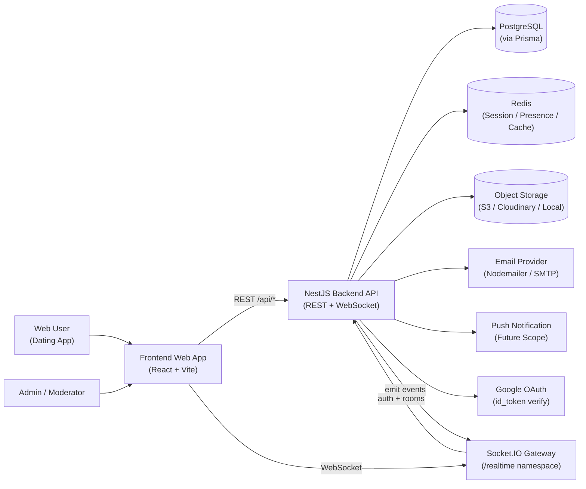
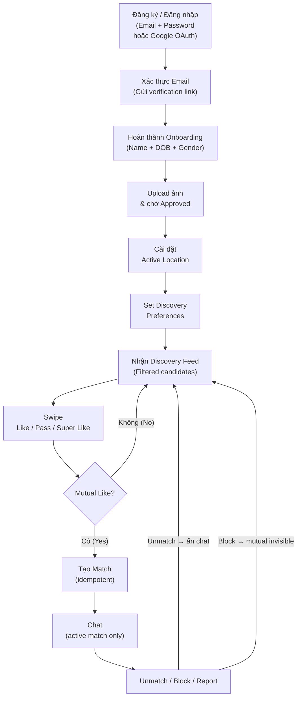
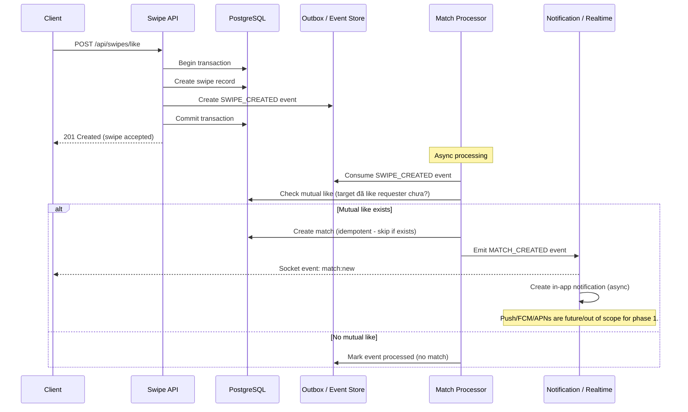
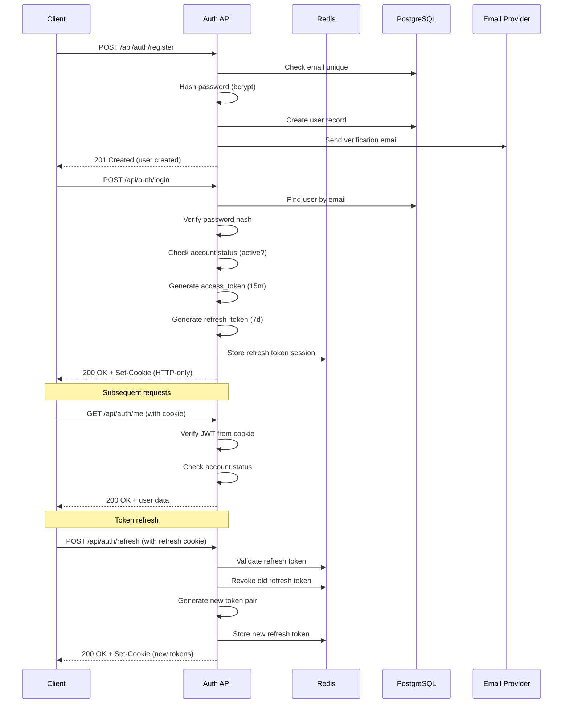
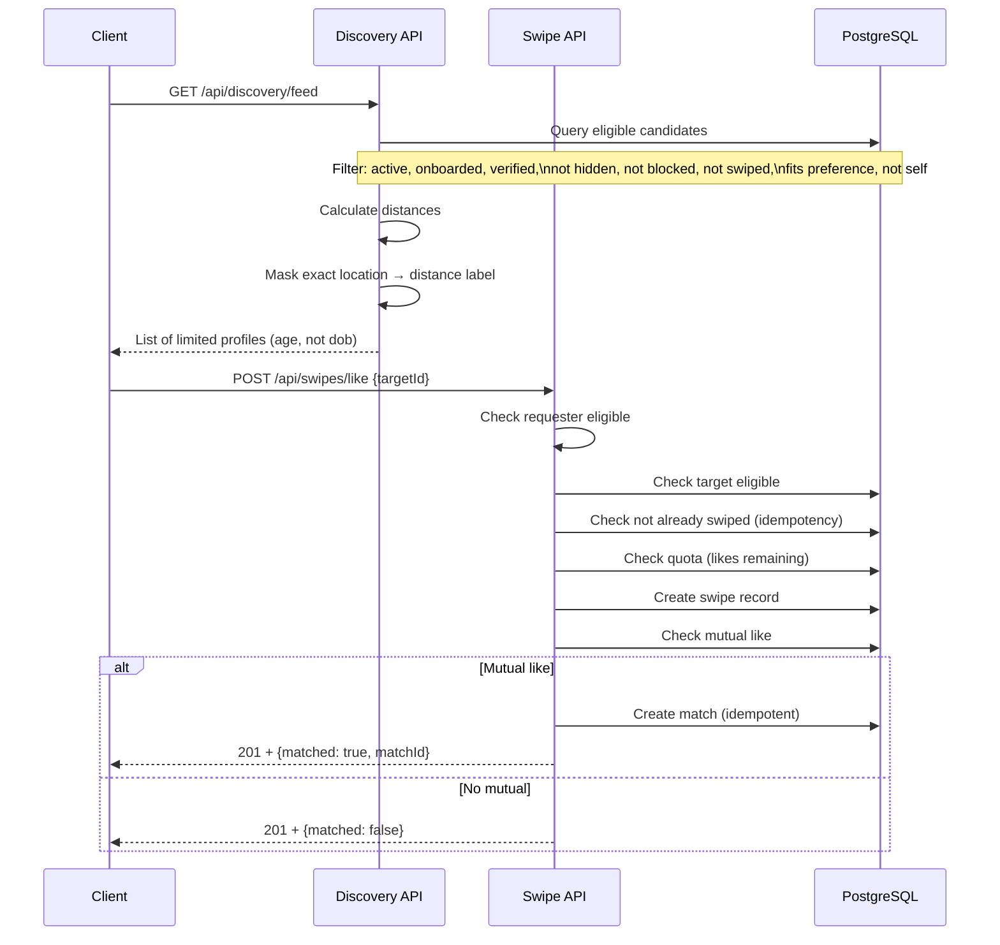
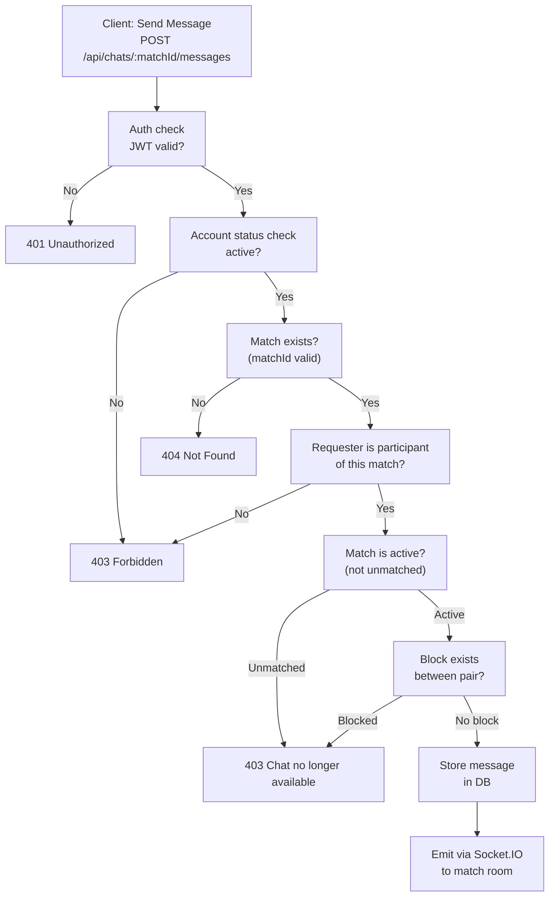
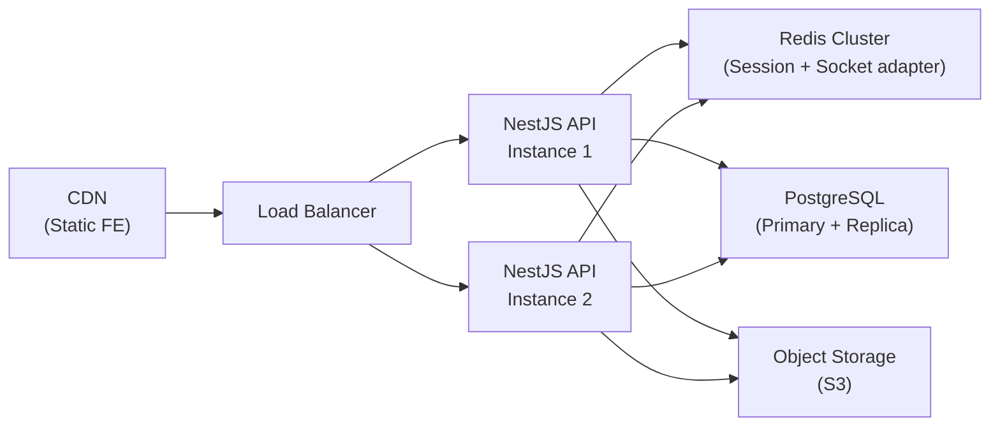

# CHANGELOG & REVISION HISTORY

| Date | Change Summary | Sections Changed |
|---|---|---|
| 2026-06-11 | Initial system context diagram và core domain flows | Toàn bộ file |

---

# System Context — Dating / Social Matchmaking Platform

Tài liệu này mô tả kiến trúc hệ thống ở mức high-level: các actor, external systems, và luồng domain chính.

---

## SC-01: C4-Style Context Diagram

**Ghi chú trạng thái hiện tại (2026-06-11):**
- `PostgreSQL` → Chưa connected production. `prisma/schema.prisma` chưa có model.
- `Redis` → Đã setup nhưng chưa fully integrated (session/presence chưa dùng).
- `Storage` → Chưa implement, không có module.
- `Email` → Đã có Nodemailer config, dùng trong auth flows.
- `Push` → Placeholder, luôn throw Error.
- `OAuth` → Đã implement Google OAuth server-side verify.
- `Socket` → Placeholder gateway, chưa có auth, chỉ có ping/pong.

---

## SC-02: Core Domain Flow

---

## SC-03: Event-Driven Match Target Architecture

Đây là **target architecture** cho production. Hiện tại chưa được implement (dùng direct service call).

**Trạng thái hiện tại:** In-memory mock, không có outbox, không có worker. Match được check và tạo trực tiếp trong service call sau khi swipe.

---

## SC-04: Auth Flow

---

## SC-05: Discovery & Swipe Flow

---

## SC-06: Chat Permission Flow

---

## SC-07: Runtime URLs

| URL | Mô tả |
|---|---|
| `http://localhost:3000/api` | REST API base |
| `http://localhost:3000/api/health` | Health check endpoint |
| `http://localhost:3000/docs` | Swagger UI |
| `http://localhost:3000/realtime` | Socket.IO namespace |

---

## SC-08: Deployment Target (Future)

Đây là target deployment architecture — **chưa implement, ghi để định hướng**:

**Notes:**
- Socket.IO scaling cần Redis adapter khi chạy nhiều instances.
- Redis session phải shared giữa all instances.
- PostgreSQL replica cho read queries (discovery feed) — Future Improvement.
