# CHANGELOG & REVISION HISTORY

| Date | Change Summary | Sections Changed |
|---|---|---|
| 2026-06-11 | Initial core flows documentation với Mermaid diagrams | Toàn bộ file |

---

# Core Flows — Dating / Social Matchmaking Platform

Tài liệu này mô tả chi tiết các luồng nghiệp vụ cốt lõi bằng Mermaid diagrams kèm notes về privacy, security và implementation gaps.

---

## FLOW-01: Registration / Login Flow

### Goal
Cho phép user tạo tài khoản mới hoặc đăng nhập vào tài khoản cũ.

### Actor
Guest (chưa authenticated)

### Preconditions
- Không cần precondition (public endpoint)

### Main Flow

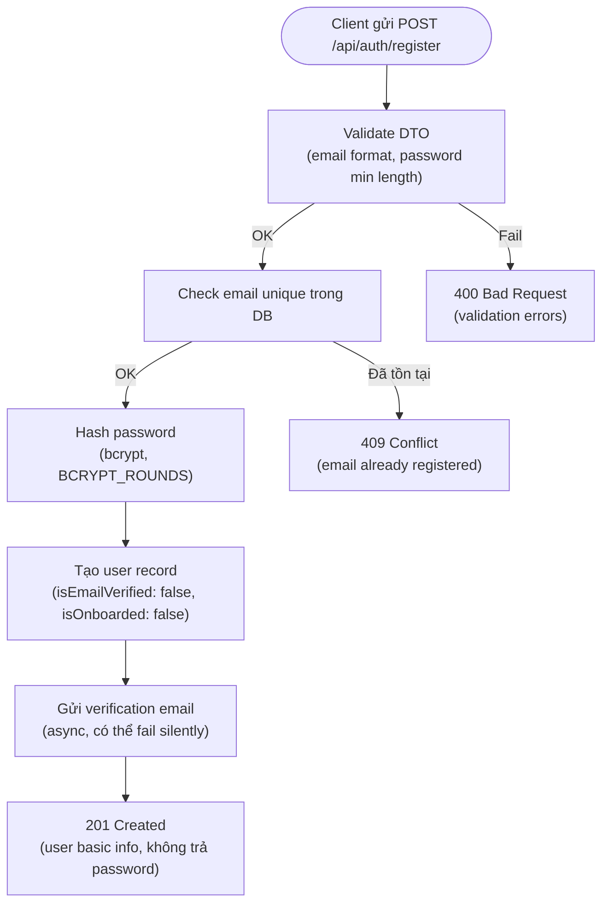

### Login Flow

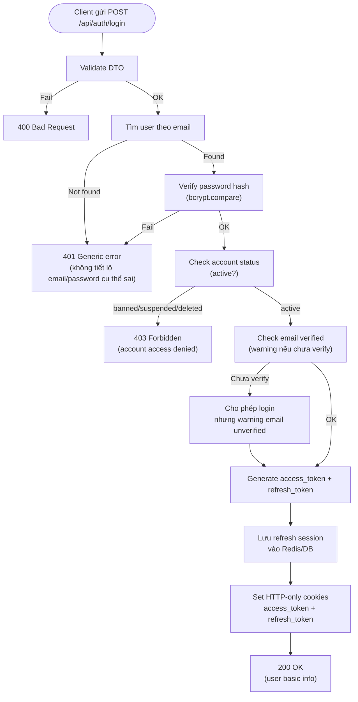

### Privacy / Security Notes
- Error message cho login failure phải generic (anti-enumeration).
- Cookie phải HttpOnly, Secure (production), SameSite.
- Account status check bắt buộc sau JWT verify.

### Implementation Gaps
- **CSRF protection** chưa rõ cho mutation endpoints.
- **Account status guard** trong `JwtAccessGuard` chưa verify.
- **In-memory repo** — data reset khi restart server.

---

## FLOW-02: Onboarding Completion Flow

### Goal
User hoàn thành tất cả bước onboarding để trở thành discoverable.

### Actor
Authenticated User (email verified)

### Preconditions
- User đã đăng ký và email verified.

### Main Flow

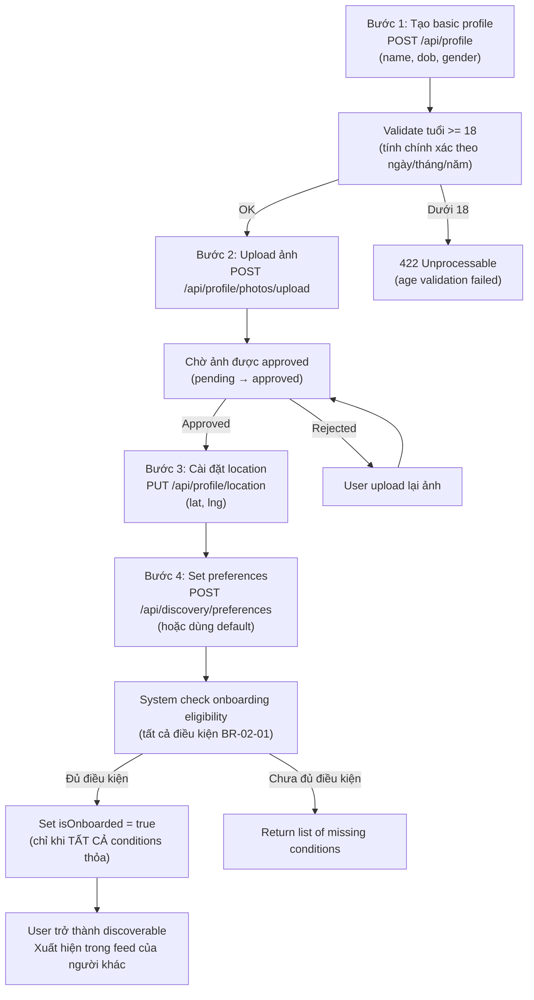

### Privacy / Security Notes
- DOB phải được validate server-side, không tin client-side age check.
- Photo approval flow phải có — auto-approve hay manual review cần chốt.

### Implementation Gaps
- **isOnboarded business rule**: Hiện tại chưa rõ `isOnboarded` được set như thế nào và khi nào — cần review.
- **Photo approval flow**: Chưa có storage module, chưa có approval flow.
- **Onboarding eligibility check endpoint**: Cần verify tồn tại.

---

## FLOW-03: Discovery Feed Flow

### Goal
User nhận danh sách candidates phù hợp để swipe.

### Actor
Authenticated User (onboarded)

### Preconditions
- User đã onboarded (có profile, location, preferences, approved photo).
- User không ở hidden mode.

### Main Flow

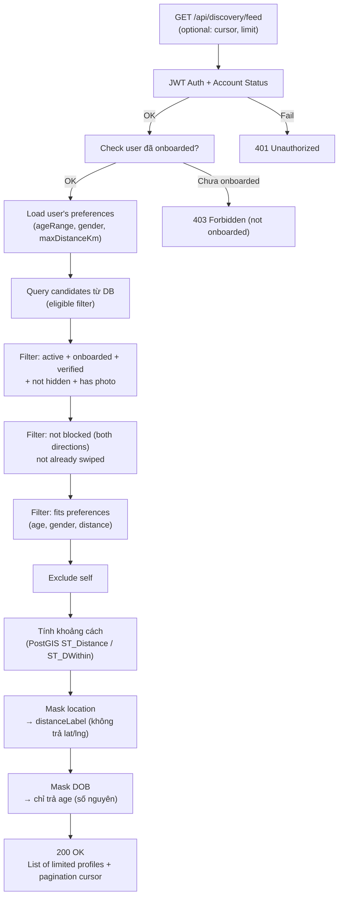

### Privacy / Security Notes
- KHÔNG trả exact lat/lng trong response.
- KHÔNG trả DOB — chỉ trả `age`.
- KHÔNG trả `userId` trực tiếp trong discovery context (dùng cách approach khác để prevent user enumeration) — **Open Question: cần chốt**.
- Response phải exclude tất cả private fields.

- **In-memory repo**: Discovery filtering hiện dùng mock data. (Chờ migrate sang Prisma).
- **Distance calculation**: Dùng PostGIS `ST_Distance` cho production.
- **Mutual preference filtering**: Chưa rõ có filter hay không.
- **Cursor pagination**: Cần verify implementation.

---

## FLOW-04: Swipe Like / Pass Flow

### Goal
User thực hiện swipe action (like/pass/super like) lên một candidate.

### Actor
Authenticated User (onboarded)

### Preconditions
- User đã onboarded.
- Target đã xuất hiện trong discovery feed của user.

### Main Flow

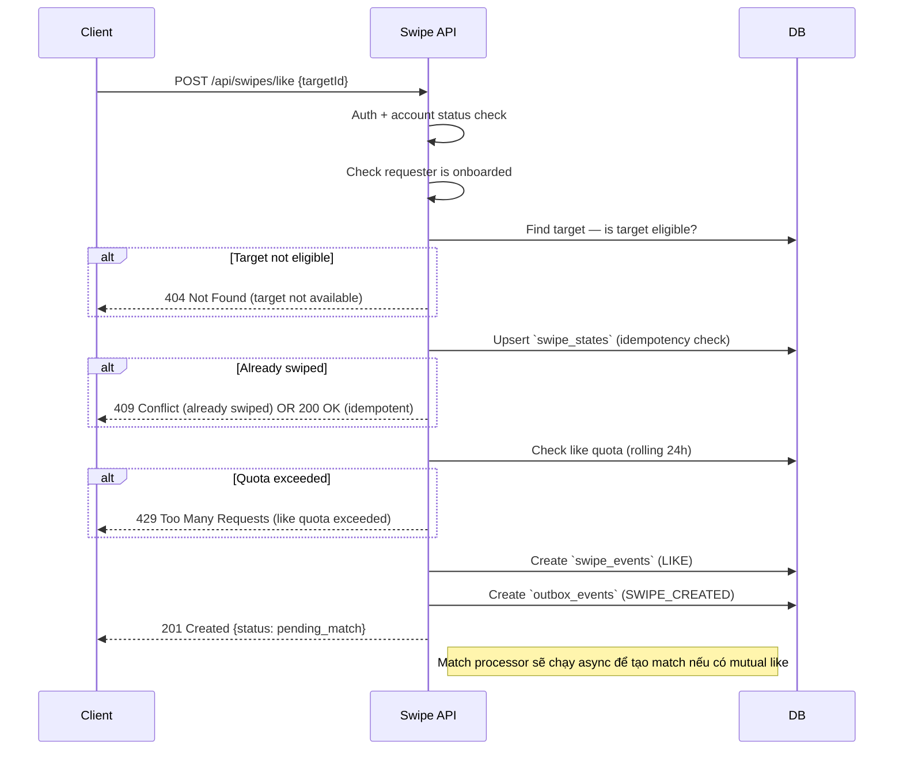

### Alternative Flows
- **Pass flow**: Tương tự like nhưng không check quota, không tạo match. Action = `PASS`.
- **Super Like flow**: Như like nhưng check super like quota riêng.
- **Rewind**: Chỉ áp dụng cho last swipe, trong điều kiện rõ (cần chốt).

### Privacy / Security Notes
- Response khi target not eligible phải generic (không tiết lộ tại sao — blocked/hidden/banned).
- Swipe target không được expose exact location.

### Implementation Gaps
- **Event-driven match**: Hiện tại match được tạo trong cùng request (inline) do mock repo. Target architecture dùng `swipe_events` + `outbox_events` + match processor.

---

## FLOW-05: Mutual Like → Match Flow

### Goal
Khi có mutual like, hệ thống tạo match và notify cả 2 users.

### Actor
System (triggered by swipe)

### Preconditions
- User A đã like User B.
- User B vừa like User A.

### Main Flow

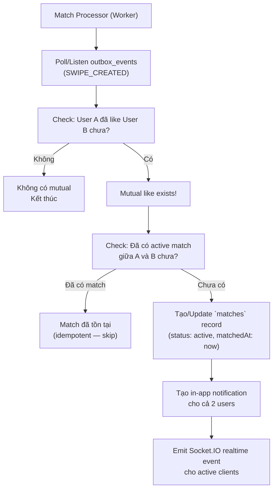

### Privacy / Security Notes
- Match notification không được expose userId của người kia theo cách có thể enumerate — dùng matchId.
- Notification không gửi nếu một trong 2 đã block nhau.

### Implementation Gaps
- **Idempotency**: Database đã có unique constraint `(user_a_id, user_b_id)` cho match pair.
- **Race condition**: Đã giải quyết ở schema, nhưng runtime worker cần xử lý.
- **Realtime gateway**: Chưa có auth, chưa có match rooms.
- **Notification**: Notification lưu DB phase 1, push/FCM là future.

---

## FLOW-06: Chat Permission Flow

### Goal
Xác định user có được phép gửi message trong một conversation hay không.

### Actor
Authenticated User

### Preconditions
- User đã login.
- User muốn gửi message tới một matchId.

### Main Flow

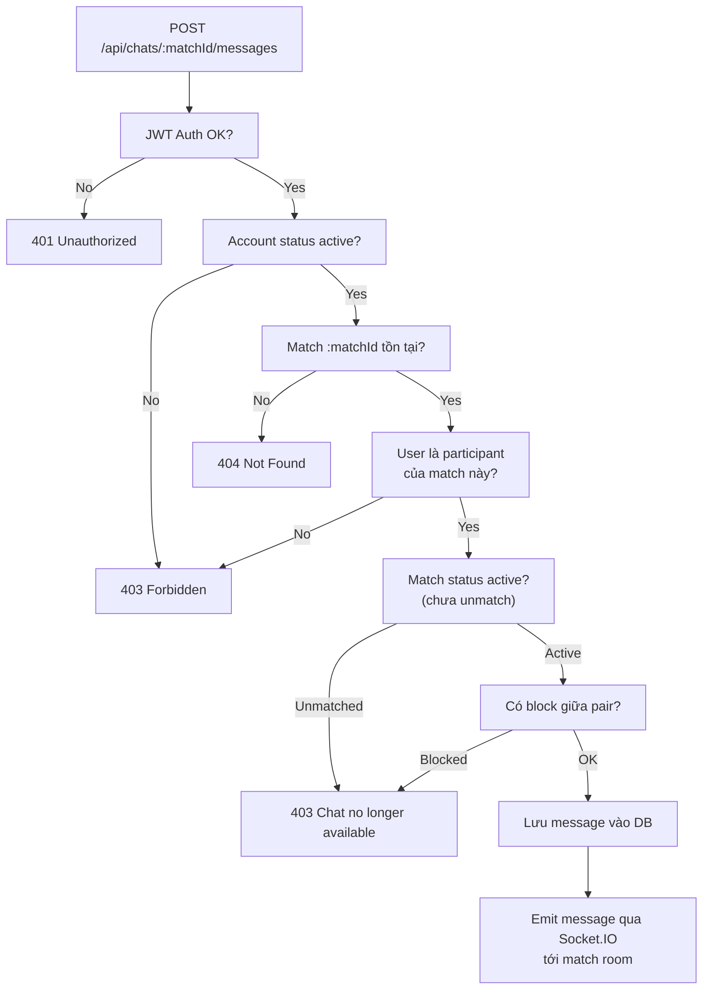

### Privacy / Security Notes
- `403 Chat no longer available` phải là generic — không tiết lộ lý do (unmatch vs block).
- Message content phải không được log.
- Chỉ participants mới có thể read messages — không có public read.

### Implementation Gaps
- **Chat module**: Chưa có (`src/modules/chat` chưa tồn tại).
- **Socket authentication**: Gateway hiện tại không authenticate.

---

## FLOW-07: Block / Report Flow

### Goal
User bảo vệ bản thân bằng cách block hoặc report người khác.

### Actor
Authenticated User

### Preconditions
- User đã login.

### Block Flow

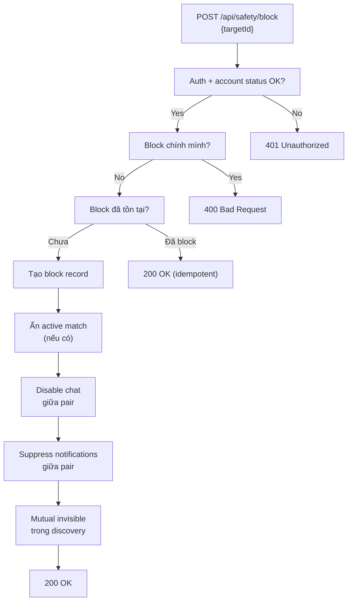

### Report Flow

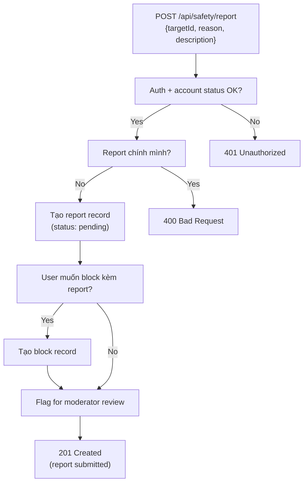

### Privacy / Security Notes
- Blocked user nhận generic error — không biết mình bị block.
- Report detail là sensitive data — không log, không expose.
- Multiple reports có thể trigger auto-flag — **Open Question: threshold là bao nhiêu?**

### Implementation Gaps
- **Safety module**: Chưa có (`src/modules/safety` chưa tồn tại).
- Block không được apply vào discovery/match/chat queries hiện tại vì module chưa có.

---

## FLOW-08: Account Deletion / Restoration Flow

### Goal
User xóa tài khoản (soft delete) và có thể khôi phục trong 30 ngày.

### Actor
Authenticated User

### Deletion Flow

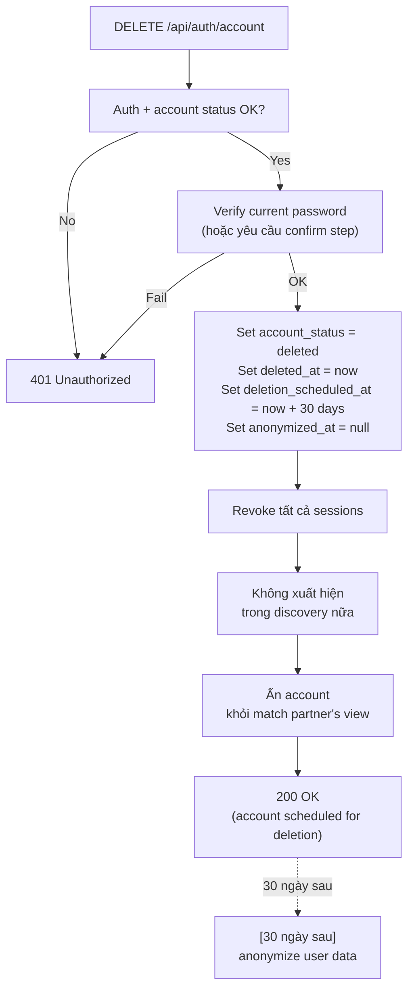

### Restoration Flow

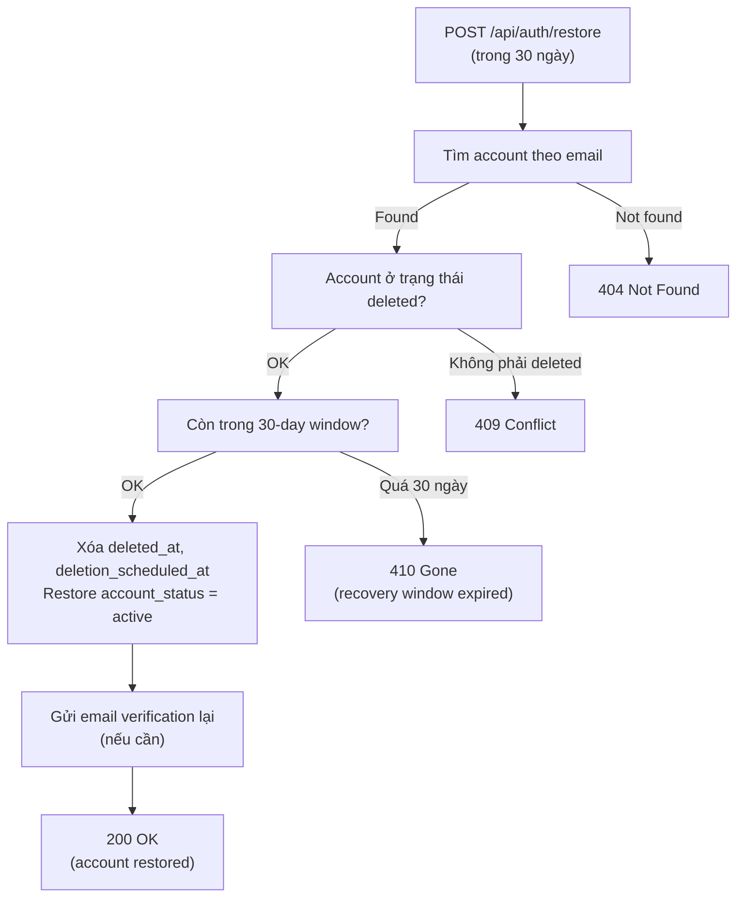

### Privacy / Security Notes
- Sau deletion: data không bị xóa ngay — giữ cho investigation purposes.
- Message data sau hard delete: **Open Question**.

### Implementation Gaps
- **30-day hard delete job**: Chưa có scheduled job.
- **Soft delete effect on match/chat**: Cần verify behavior.
